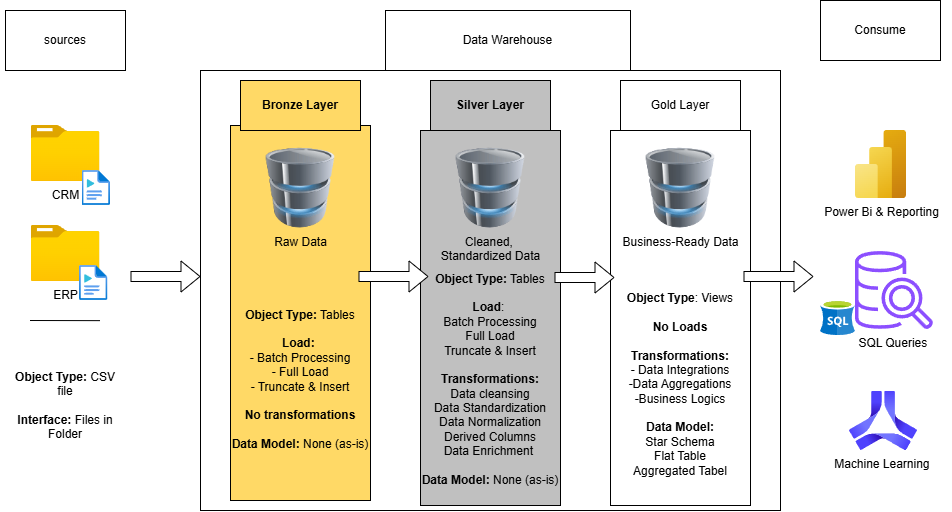
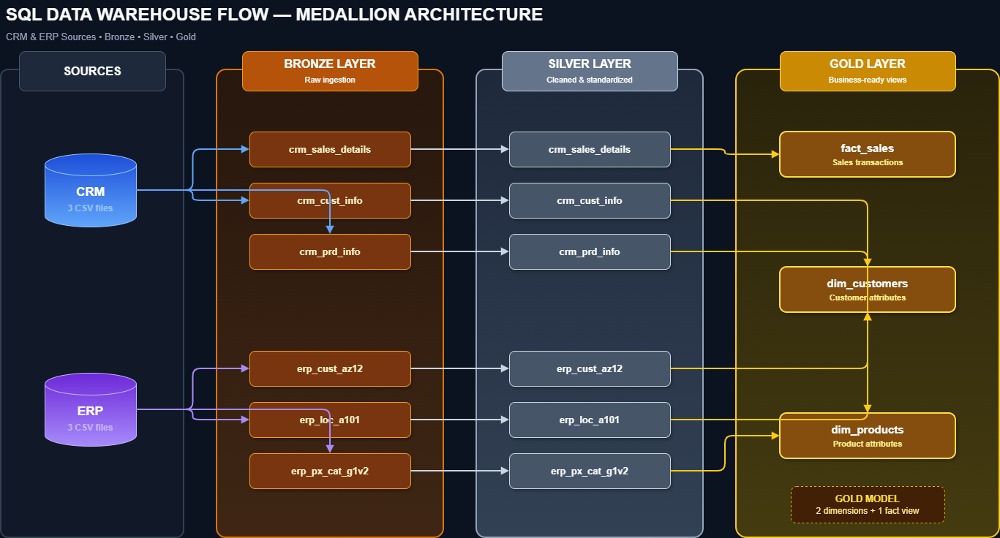
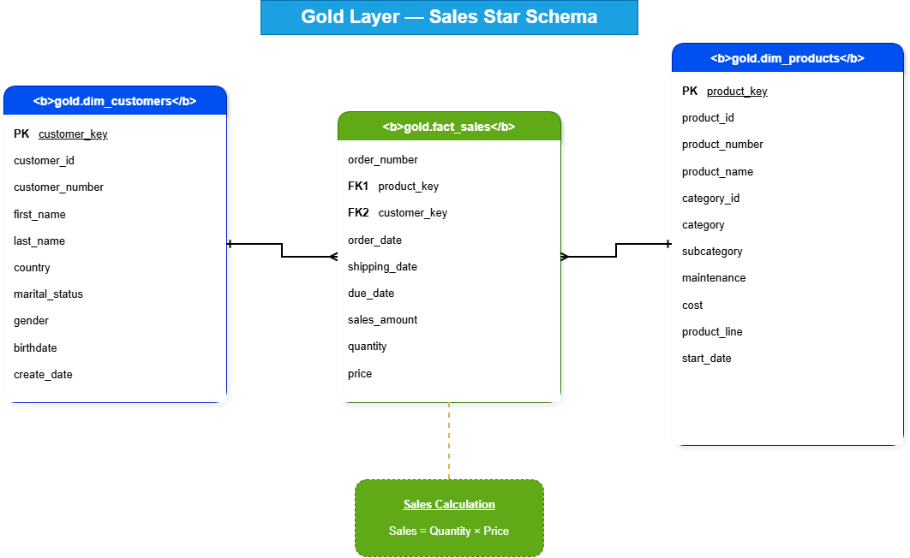

# SQL Data Warehouse Project

## Overview

This project demonstrates the end-to-end development of a modern data warehouse using **SQL Server** and **T-SQL**. It integrates data from CRM and ERP source systems, applies data cleansing and transformation rules, and delivers a business-ready star schema for reporting and analytics.

The project follows the **Medallion Architecture** with Bronze, Silver, and Gold layers.

## Project Objectives

- Consolidate CRM and ERP data into a centralized data warehouse.
- Build repeatable ETL pipelines using SQL stored procedures.
- Clean, standardize, and enrich raw source data.
- Resolve data quality issues such as duplicates, missing values, invalid dates, and inconsistent codes.
- Create a star schema optimized for analytical queries.
- Document the final data model with diagrams and a data catalog.

## Data Architecture

The architecture moves data from CSV source files through three transformation layers before making it available for reporting and analytics.



### Architecture Layers

| Layer | Purpose | Main Operations |
|---|---|---|
| **Bronze** | Stores raw CRM and ERP data in its original form. | Full load, truncate and insert, CSV ingestion with `BULK INSERT` |
| **Silver** | Produces clean and standardized datasets. | Deduplication, normalization, null handling, date validation, derived columns |
| **Gold** | Delivers business-ready analytical views. | Data integration, business logic, aggregations, dimensional modeling |

### Data Flow and Lineage

The following diagram provides a table-level view of how data moves through the warehouse. CRM and ERP CSV files are first loaded into matching Bronze tables, transformed into clean Silver tables, and then integrated into the Gold analytical model.



- CRM sales data becomes the `gold.fact_sales` view.
- CRM customer data is combined with ERP demographics and location data to create `gold.dim_customers`.
- CRM product data is enriched with ERP category data to create `gold.dim_products`.
- The resulting Gold views form the star schema used for reporting and analysis.

## Gold-Layer Data Model

The Gold layer uses a **star schema** consisting of two dimensions and one fact table:

- `gold.dim_customers`: consolidated customer attributes from CRM and ERP.
- `gold.dim_products`: current product, category, and subcategory information.
- `gold.fact_sales`: sales transactions connected to customers and products.



### Relationships

| Dimension | Primary Key | Fact Table Foreign Key | Relationship |
|---|---|---|---|
| `gold.dim_customers` | `customer_key` | `gold.fact_sales.customer_key` | One-to-many |
| `gold.dim_products` | `product_key` | `gold.fact_sales.product_key` | One-to-many |

For detailed column definitions, data types, and business descriptions, see the [Data Catalog](docs/data_catalog.md).

## ETL Process

### 1. Extract and Load — Bronze

The Bronze stored procedure:

- Truncates existing Bronze tables.
- Loads CRM and ERP CSV files using `BULK INSERT`.
- Records the duration of each table load.
- Uses `TRY...CATCH` for error handling.

### 2. Transform — Silver

The Silver stored procedure applies transformations such as:

- Keeping the most recent customer record with `ROW_NUMBER()`.
- Standardizing gender, marital status, country, and product-line values.
- Removing unwanted prefixes and characters from business keys.
- Replacing missing product costs.
- Validating and converting dates.
- Deriving product end dates with `LEAD()`.
- Recalculating invalid sales and price values.
- Recording data-load durations.

### 3. Model — Gold

The Gold layer:

- Integrates CRM and ERP customer information.
- Enriches products with category and subcategory data.
- Filters products to their current active records.
- Creates surrogate keys for customer and product dimensions.
- Connects sales transactions to both dimensions.

## Repository Structure

```text
SQL-data-Warehouse-Project/
├── datasets/
│   ├── source_crm/
│   └── source_erp/
├── docs/
│   ├── data_catalog.md
│   ├── data_warehouse_archi.drawio.png
│   ├── data_warehouse_flow.png
│   └── gold_layer_star_schema.drawio.png
├── gold/
│   └── ddl_gold.sql
├── scripts/
│   ├── bronze/
│   │   ├── ddl_bronze.sql
│   │   └── proc_load_bronze.sql
│   ├── silver/
│   │   ├── ddl_silver.sql
│   │   └── proc_load_silver.sql
│   └── init_database.sql
└── README.md
```

## How to Run the Project

### Prerequisites

- Microsoft SQL Server
- SQL Server Management Studio (SSMS)
- Permission to create databases, schemas, tables, views, and stored procedures

### Execution Order

1. Run `scripts/init_database.sql` to create the database and schemas.
2. Run the Bronze DDL script to create the raw-data tables.
3. Update the CSV paths inside the Bronze load procedure for your local environment.
4. Execute the Bronze load procedure:

```sql
EXEC bronze.load_bronze;
```

5. Run the Silver DDL script.
6. Execute the Silver load procedure:

```sql
EXEC silver.load_silver;
```

7. Run `gold/ddl_gold.sql` to create the analytical views.
8. Query the Gold layer:

```sql
SELECT TOP 100 *
FROM gold.fact_sales;
```

> **Note:** The `BULK INSERT` file paths are environment-specific and must be updated before running the Bronze load procedure.

## Key SQL Concepts Demonstrated

- Medallion architecture
- ETL pipeline development
- Stored procedures
- `BULK INSERT`
- Window functions: `ROW_NUMBER()` and `LEAD()`
- Data cleansing and standardization
- Derived columns and business rules
- `LEFT JOIN` data integration
- Star-schema dimensional modeling
- Dimension and fact views
- Surrogate and business keys
- Error handling with `TRY...CATCH`

## Technologies

- **Database:** Microsoft SQL Server
- **Language:** T-SQL
- **Data sources:** CSV files
- **Modeling approach:** Star schema
- **Architecture:** Bronze, Silver, and Gold layers
- **Documentation:** Markdown and diagrams.net

## Author

**Alberto Franco**

This project was created as part of my data analytics and data engineering portfolio to demonstrate practical SQL, ETL, data modeling, and documentation skills.
